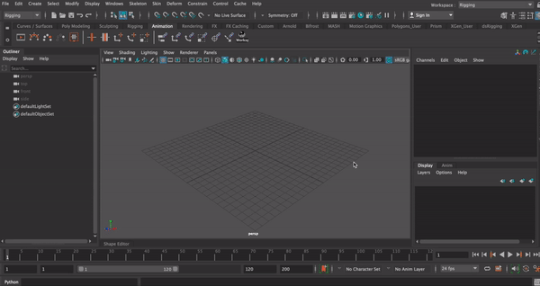

# dsWorkspaceToggle

 Favorite Maya workspaces and cycle through them with a hotkey 

 ## Demo
 

 ## Installation
 1. Clone/download repo to anywhere on your machine
 2. Create **dsWorkspaceToggle.mod** in *documents/maya/modules*
 3. Add the following lines to it:

```mod
+ dsWorkspaceToggle 0.0.1 your/path/here/dsWorkspaceToggle
scripts: your/path/here/dsWorkspaceToggle
```

4. To launch UI run following code:

```py
import dsWorkspaceToggle
dsWorkspaceToggle.toggleUI.Dialog.display()
```

## Known issues:
- Setting hotkey to a new button will not delete previous hotkey as Maya remembers it and saves to mel file on exit. 
**Current solution:** manually delete hotkey from mel file.
- No check for conflicting key with Shift modifier. (No check available? http://download.autodesk.com/us/maya/2011help/Commandspython/hotkeyCheck.html)